# Light File Processing for DUNE 2x2

## Setup

I have a directory called `dune` in which I have `ndlar_flow` <https://github.com/DUNE/ndlar_flow> and this repo:
```
cd dune
git clone https://github.com/jvmead/light_file_processing.git
cd light_file_processing
mkdir outputs
```

I prefer running in `screen` <https://hsf-training.github.io/analysis-essentials/shell-extras/screen.html> for safety of mind when running remotely.
I would strongly recommend using `remote-ssh` - config can be tricky for NERSC so see bottom of cheat sheet <https://surfdrive.surf.nl/index.php/s/jDkQV9ipn9l1ts5>.

Inside the screen (or not) using the ndlar_flow virtual environment in the adjacent directory for convenience:
```
source /global/homes/<u/user>/dune/ndlar_flow/ndlar_flow.venv/bin/activate
```

## Running the Optimized Processing Script (Recommended for >100 files)

The optimized version (`to_dataframes_optimized.py`) processes files one-by-one to minimize memory usage and includes optional parallel processing. This is **strongly recommended for processing more than 100 MC files**.

Key improvements over the original:
- Process truth and sum hits for each file sequentially (much lower memory footprint)
- Match truth-to-reco per file rather than all at once
- Append results incrementally to avoid memory crashes
- Optional parallel processing with `--parallel` flag
- Chunked reading for large files
- Progress bars
- Resume capability with `--resume` flag

### Basic usage:
```bash
python to_dataframes_optimized.py --stage truth sum_tpc flashes match \
                                   --nfiles 100 \
                                   --indir /global/cfs/cdirs/dune/www/data/2x2/simulation/productions/MiniRun6.4_1E19_RHC/MiniRun6.4_1E19_RHC.flow/FLOW/0000000/ \
                                   --outdir outputs/
```

### Advanced options:
```bash
python to_dataframes_optimized.py --stage truth sum_tpc flashes match \
                                   --nfiles 500 \
                                   --indir /path/to/input/ \
                                   --outdir outputs/ \
                                   --ph_th 0 \
                                   --dE_th 0.0 \
                                   --parallel 4 \
                                   --tag run1 \
                                   --resume \
                                   --overwrite
```

### Arguments:
- `--stage`: Processing stages to run (truth, sum_tpc, flashes, match, or all)
- `--nfiles`: Number of files to process
- `--indir`: Input directory containing FLOW HDF5 files
- `--outdir`: Output directory for CSV files
- `--ph_th`: Photon threshold (default: 0)
- `--dE_th`: Energy deposition threshold in MeV (default: 0.0)
- `--parallel`: Number of parallel processes (default: 1 for sequential)
- `--tag`: Optional tag to add to output filenames
- `--resume`: Resume from last processed file
- `--overwrite` or `--ow`: Overwrite existing output files
- `--chunk_size`: Chunk size for reading large files (optional)

Different `stage`s can be run separately and will be read in if they already exist when running the `match` stage.

---

## Analysis Notebooks

This repository contains various Jupyter notebooks for analyzing DUNE 2x2 light system data:

### Sum Hit Analysis & Plotting
- **plotting_sum_hit_analysis.ipynb** - Hit amplitude distributions for highest-energy detector hits per event
- **plotting_sum_hit_analysis_localized.ipynb** - Localized version of sum hit analysis with coordinate transformations
- **plotting_sum_hit_analysis_localized_min_th.ipynb** - Localized sum hit analysis with minimum threshold applied
- **plotting_sum_hit_analysis_multi_threshold.ipynb** - Multi-threshold analysis of sum hit characteristics
- **plotting_sum_hit_analysis_multi_threshold_localized.ipynb** - Localized multi-threshold sum hit analysis
- **plotting_tpc_sum_hit_analysis.ipynb** - Hit analysis aggregated by TPC regions
- **plotting_tpc_sum_hit_analysis_new.ipynb** - Updated version of TPC-aggregated hit analysis

### Threshold & Hit Selection
- **threshold_sum_hits_test.ipynb** - Tests threshold-based hit selection for signal efficiency studies
- **threshold_sum_hits_test_localized.ipynb** - Threshold tests with localization corrections applied

### Comparison & Validation
- **compare_outputs.ipynb** - Merges truth and reconstructed event data; matches interactions with detector hits and extracts correlations

---

## Example Plots

### Detector Efficiency Slices
Efficiency maps showing detector response across different spatial slices:

<table>
  <tr>
    <td>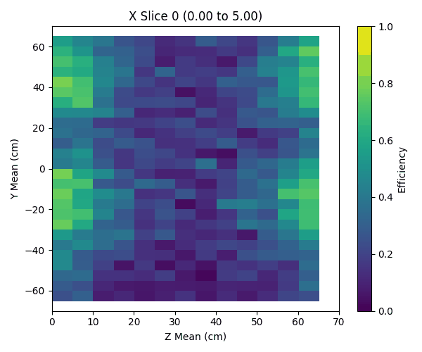</td>
    <td>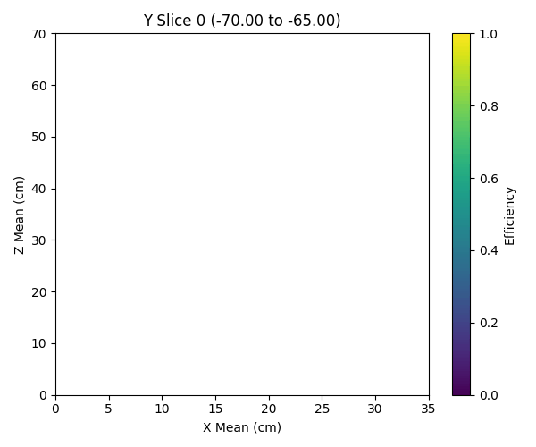</td>
    <td>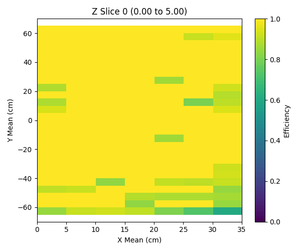</td>
  </tr>
  <tr>
    <td align="center">X-slice efficiency</td>
    <td align="center">Y-slice efficiency</td>
    <td align="center">Z-slice efficiency</td>
  </tr>
</table>

### Spatial Distributions
Position distributions for triggered and untriggered events, plus coordinate transformations:

<table>
  <tr>
    <td>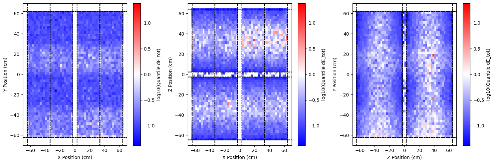</td>
    <td>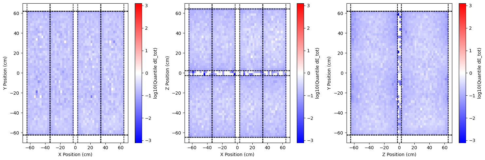</td>
    <td>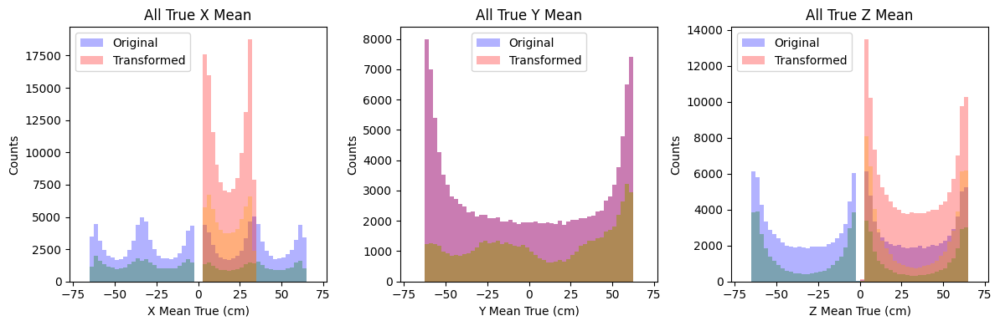</td>
  </tr>
  <tr>
    <td align="center">Triggered events (16th percentile)</td>
    <td align="center">Untriggered events (84th percentile)</td>
    <td align="center">Coordinate transformations</td>
  </tr>
</table>

### Voxel Analysis
Quantile analysis of detector response in voxelized space:

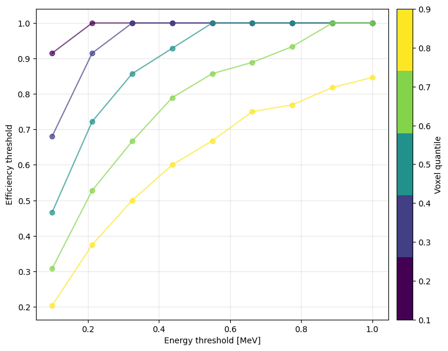

### Efficiency Analysis
Detection efficiency as a function of various event properties:

<table>
  <tr>
    <td>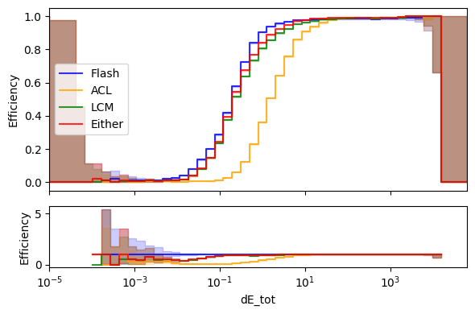</td>
    <td>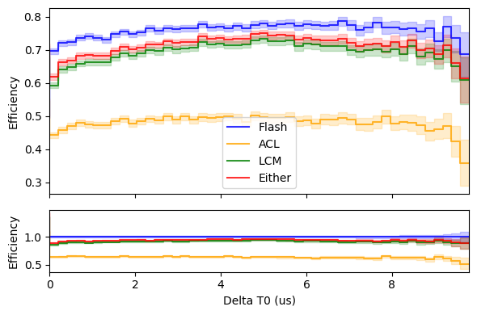</td>
  </tr>
  <tr>
    <td align="center">Efficiency vs total deposited energy</td>
    <td align="center">Efficiency vs timing offset (delta t0)</td>
  </tr>
  <tr>
    <td>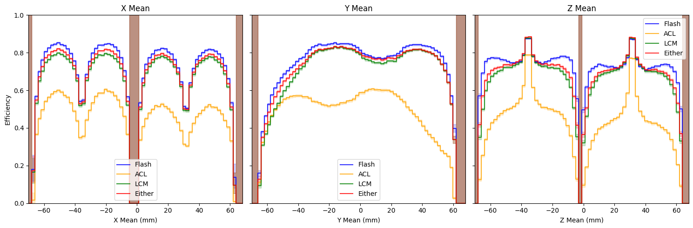</td>
    <td>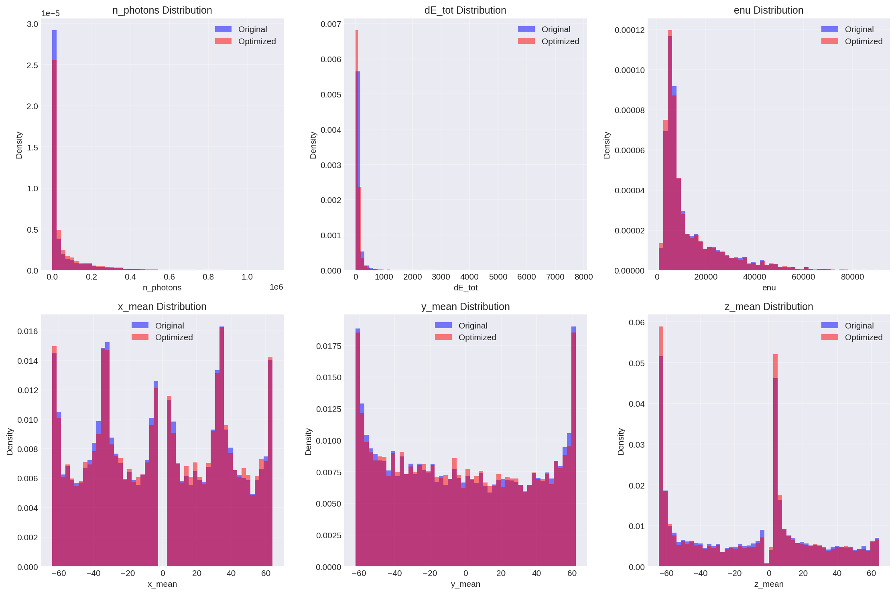</td>
  </tr>
  <tr>
    <td align="center">Non-localized efficiency in XYZ space</td>
    <td align="center">Distribution comparisons</td>
  </tr>
</table>

### Pileup Analysis
Analysis of pileup effects on reconstruction efficiency and fake rate:

<table>
  <tr>
    <td>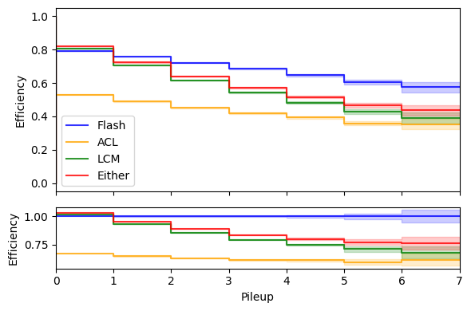</td>
    <td>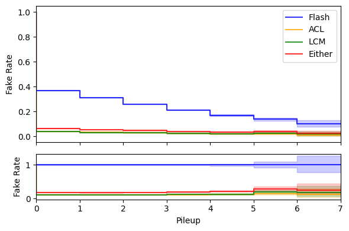</td>
  </tr>
  <tr>
    <td align="center">Reconstruction efficiency vs pileup</td>
    <td align="center">Fake rate vs pileup</td>
  </tr>
</table>

---

## Deprecated: Original Processing Script

**Note:** The original `to_dataframes.py` script is suitable for small datasets (<100 files) but may encounter memory issues with larger datasets. For processing more than 100 MC files, please use `to_dataframes_optimized.py` instead.

### Running the original script:
```
python to_dataframes.py --stage truth sum_tpc flashes match
                        --nfiles 100
                        --indir /global/cfs/cdirs/dune/www/data/2x2/simulation/productions/MiniRun6.4_1E19_RHC/MiniRun6.4_1E19_RHC.flow/FLOW/0000000/
                        --outdir outputs/
```
Different `stage`s can be run separately and then will be read in if they already exist when running the `match` stage to optionally save time.
If you wish to override this default, use the `--overwrite` argument.

### Potential improvements:
One potential improvement might be to have `--outdir` generate a directory from the path if it doesn't exist and then handle the book-keeping implicitly.
Another might be to incorporate the arguments for thresholds already included (and truth match time window tolerance not yet included) into the output file/dir naming convention.
Alternatively, a timestamped directory could be generated upon running and a copy of the input arguments saved to a `config.json` in said directory.
